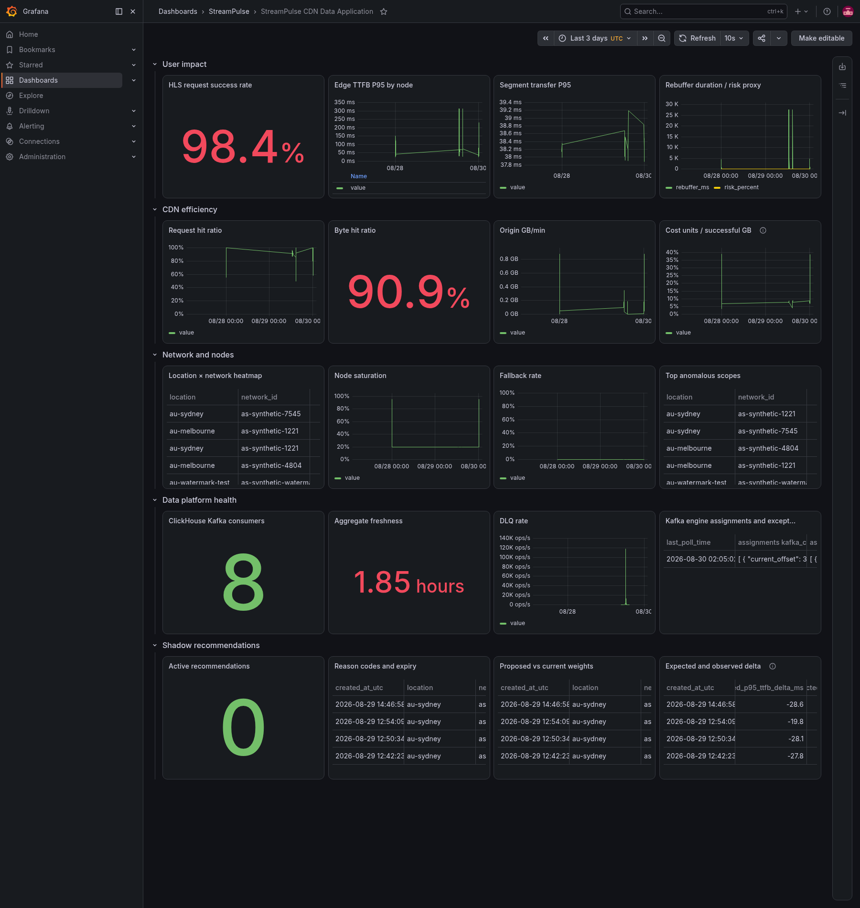

# StreamPulse

StreamPulse is a CDN data application that turns synthetic delivery, routing,
and player events into event-time metrics and auditable **shadow** routing
recommendations. It is built to demonstrate correctness under out-of-order
events, replay, component failure, and stale data—not merely to launch a
dashboard.

> Runtime scaffold derived from Apache Flink Playgrounds; CDN schemas,
> analytics jobs, ClickHouse pipeline, recommendation service, experiments and
> documentation are implemented in this repository.

## Current status

Day 1 contracts, the Day 2 deterministic generator, the Day 3 core Flink
analytics job, and the Day 4 ClickHouse/Grafana path are implemented and
broker-integrated. The Day 5 recommendation API, explainable detectors, scorer,
guardrails, Kafka publication, complete ClickHouse audit record, and durable
ack/outcome path have passed a real fault-injection gate. Day 6 detector
comparison is complete across three independently seeded Kafka/Flink/ClickHouse
runs. The ClickHouse pause/catch-up and Flink TaskManager checkpoint-recovery
gates also passed. An isolated two-partition integration gate also verified idle
partition watermark progress, allowed-late revision, and too-late DLQ routing.
Day 7 cross-event contracts, CI configuration, evidence-backed resume bullets,
and the synthetic demo entry point are implemented; the demo itself passed a
fresh end-to-end run. The
repository contains four v1 event schemas, compatibility/privacy enforcement,
topic design, fixed-seed CDN fault scenarios, Kafka and JSONL sinks, manifest
generation, event-time/watermark handling, deduplication, DLQ/late outputs, and
node/network/content window aggregation. Kafka Engine tables and materialized
views persist raw and aggregate data with explicit TTLs; a provisioned Grafana
dashboard exposes 20 verified queries. The upstream Apache Kafka/Flink operations
example is pinned at commit
`6115f8e6d083b1b69f7c82b19d5723a90aed95a1`.

The upstream job is runtime-verified on Docker Desktop through a documented
official Kafka-image substitution: the original unavailable
`bitnami/kafka:3.9.0` reference is overlaid with `apache/kafka:3.9.0`. Kafka was
healthy, the job produced output, and all four vertices recovered in 6 seconds
after the only TaskManager was restarted. See
[`docs/upstream-baseline.md`](docs/upstream-baseline.md).

The StreamPulse integration run sent 22,800 fixed-seed requests through real
Kafka topics. Flink reached zero source lag, emitted all three aggregate types,
completed 21/21 observed checkpoints in the ClickHouse-integrated run, and produced a 219-record DLQ for
exactly 219 injected contract errors. See
[`experiments/reports/flink-integration/report.md`](experiments/reports/flink-integration/report.md)
and
[`experiments/reports/clickhouse-grafana/report.md`](experiments/reports/clickhouse-grafana/report.md).

## Architecture

```text
synthetic CDN/player events
          |
          v
       Kafka raw topics ---> dead-letter topic
          |
          v
  Flink event-time jobs
          |
          +----> Kafka aggregate topics ----> ClickHouse ----> Grafana/API
          |
          +----> completed-window features ----> shadow recommendations
```

The DNS request path never waits for StreamPulse. Recommendations carry an
expiry, evidence window, confidence, reason codes, and bounded proposed weights;
EdgeRoute integration remains an explicit later-stage contract.

### Live verification snapshot



This PNG was rendered from the live local Kafka -> Flink -> ClickHouse ->
Grafana stack, not from a mockup. The retained shadow recommendations shown in
the audit tables have passed their 120-second TTL, so `Active recommendations`
correctly reads zero while reason codes, proposed weights, and expected deltas
remain queryable.

The recommendation API follows `HTTP handler -> use case -> query repository ->
detector/scorer -> guardrail -> Kafka publisher`. It combines a fixed rule with
past-window EWMA and rolling median/MAD evidence, rejects stale/future/unhealthy/
capacity-constrained nodes, preserves at least two candidates, limits each
absolute weight step to 0.20, enforces a one-minute dwell, and emits only
two-minute `mode=shadow` events. Current code and endpoint semantics are in
[`services/recommendation-api/README.md`](services/recommendation-api/README.md).

## Contract quick start

Requires Python 3 and the pinned test dependency.

```powershell
python -m pip install -r requirements-test.txt
python -m unittest discover -s tests/schema -v
```

Expected result: eight contract tests pass. They cover minimal/full valid
events, a forward-compatible optional field, missing required fields, unknown
enums, invalid numeric bounds, expired recommendations, and forbidden privacy
data. The eighth test checks that RoutingEvent candidates and shadow
RecommendationEvent node weights form a compatible cross-project fixture.

## Five-minute synthetic demo

Prerequisites are Docker Desktop, PowerShell 7, Java 17+ with Maven, and Go
1.23+. The script starts the pinned local services, creates topics, injects a
fresh synthetic CDN fault, runs an isolated Flink job, and verifies a
TTL-bound shadow recommendation through Kafka and ClickHouse:

```powershell
powershell -NoProfile -ExecutionPolicy Bypass -File scripts/demo.ps1
```

The command leaves the reusable stack and dashboard data running, cancels its
isolated Flink job, and writes temporary evidence under `.tmp/demo/`. It never
applies a recommendation to EdgeRoute. A five-minute presentation sequence and
the expected evidence at each step are in [`docs/demo.md`](docs/demo.md).

## Generator quick start

The public workload is explicitly synthetic. A small offline smoke run requires
Go and Python but no Kafka:

```powershell
go -C services/event-generator test ./...
go -C services/event-generator run ./cmd/generator `
  -config ../../experiments/scenarios/smoke.yaml `
  -output jsonl `
  -output-file ../../.tmp/generator-smoke.jsonl `
  -manifest ../../.tmp/generator-smoke-manifest.json
python scripts/validate-generated-events.py .tmp/generator-smoke.jsonl
```

The full fixed-seed baseline generated 3,000,000 base requests twice. Both run
manifests had SHA-256
`ff5b6b60361ea1885215ac838bcbeb6eb56d25ebcd7e6faf306e7983bc9b4792`;
the maximum/median delivery-key load ratio was `1.0081`. This validates
determinism and key distribution only, not Kafka/Flink throughput. See
[`experiments/reports/generator-baseline/report.md`](experiments/reports/generator-baseline/report.md).

## Upstream playground gate

The root Compose file includes the original operations playground without
editing it:

```powershell
docker compose -f compose.yaml config
docker compose -f compose.yaml up --build -d
```

The original dependency no longer resolves; use the declared replacement layer
for the reproducible baseline command:

```powershell
docker compose -f operations-playground/docker-compose.yaml `
  -f experiments/reports/upstream-baseline/kafka-image-override.yaml `
  up --build -d
```

The upstream acceptance gate passed on 2026-08-29. This is separate from the
StreamPulse generator-to-aggregate integration gate, which also passed using
the fixed-seed integration scenario.

## Flink analytics test

```powershell
mvn -f jobs/cdn-analytics/pom.xml test
```

The Java tests use hand-calculated fixtures for exact MVP percentiles, 5xx
count, cache hits, bytes, and origin time. Compilation also verifies the Kafka
source/sinks, 10-second bounded-out-of-orderness watermark, idle-partition
handling, 5-second allowed lateness, per-window revision, and 25-hour event-ID
deduplication APIs against Flink `1.16.0`.

## ClickHouse and Grafana gate

Start the root Compose stack, create the topics, submit the analytics JAR, and
run the fixed-seed integration generator. The provisioned services are exposed
locally at ClickHouse `http://localhost:8123`, Grafana
`http://localhost:3000`, and Flink `http://localhost:8081`.

```powershell
docker compose -f compose.yaml up -d
make clickhouse-benchmark
```

The verified run populated raw delivery/routing/player tables, all three
aggregate tables, and 219 dead letters. Grafana datasource health returned
`OK`; all 20 dashboard SQL statements passed direct execution. The three fixed
query baselines record cold latency, 20-iteration hot P50/P95, rows, and bytes
in the Day 4 report. These are local synthetic measurements, not production
throughput claims.

A controlled Day 6 pause/catch-up run stopped ClickHouse before publishing a
2,600-request workload. ClickHouse consumer lag reached `6,134` while paused
and returned to `0` within `20.373` seconds of restart; target tables contained
2,572 delivery, 2,582 routing, 645 player, 12 node, and 4 network rows in the
isolated event-time range. No table was truncated or data deleted. See
[`experiments/results/clickhouse-catchup/report.md`](experiments/results/clickhouse-catchup/report.md).

The TaskManager recovery test retained the same Flink Job ID, transitioned
`6 -> 0 -> 6` running vertices, restored checkpoint 15, recovered all vertices
in 12.779 seconds, and reduced observed source lag from 2,626 to zero. Replaying
the exact same event IDs produced `1,198` unique raw requests and exactly
`1,198` node/network aggregate requests for the checked minute. The first
attempt, which exhausted an overly small three-retry budget, is retained in the
report rather than omitted. See
[`experiments/results/flink-restart/report.md`](experiments/results/flink-restart/report.md).

The watermark/lateness gate used an isolated two-partition delivery topic with
one partition intentionally idle. The target minute became visible with 600
requests at revision 0; an allowed-late event updated it to 601 at revision 1.
After allowed lateness expired, a second late event produced one redacted
`TOO_LATE` record while the aggregate remained 601/revision 1. The isolated job
was cancelled afterward and the main analytics and upstream ClickCount jobs
remained running. See
[`experiments/results/watermark-lateness/report.md`](experiments/results/watermark-lateness/report.md).

```powershell
make watermark-lateness-test
```

## Recommendation end-to-end gate

The fixed-seed fault scenario runs an isolated Flink job with a dedicated
consumer group and `latest` starting offsets, so prior experiment watermarks and
committed offsets cannot make current events late. The successful run generated
schema-v1 shadow recommendation `rec-b4861107ffbf3c4cef004a0d`; the Kafka topic
offset total advanced from `2` to `3`, and ClickHouse returned the same ID with
all three node evidence records, the input window, query version, and config
hash. TTL was 120 seconds and no absolute node-weight step exceeded 0.20.

The same run persisted one acknowledgement and one explicitly non-causal
synthetic outcome for that recommendation ID. The optional upstream ClickCount
job is suspended only when no Flink slot is free, then restored in `finally`;
the main StreamPulse job is never stopped. Evidence is in
[`experiments/reports/recommendation-api/e2e-result.json`](experiments/reports/recommendation-api/e2e-result.json).

```powershell
make recommendation-e2e
```

## Detector comparison gate

The fixed-threshold, combined-rule, and past-only EWMA/MAD strategies were
compared across three seeds. Each run preserved its generator manifest, 156
complete node-minute rows, raw per-window predictions, configuration and file
hashes. Fixed threshold and EWMA/MAD both produced mean F1 `1.0` with a
completed-window P95 detection delay of 30 seconds; the stricter combined rule
produced mean F1 `0.136508` because it required simultaneous latency and error
evidence. This synthetic result is a tie, not evidence that EWMA/MAD is better
than fixed thresholds or that either generalizes to production traffic.

```powershell
make detector-test
make detector-e2e
```

The end-to-end command requires the running root Compose stack and refuses to
overwrite an existing completed report. See
[`experiments/results/detector-comparison/report.md`](experiments/results/detector-comparison/report.md)
and its machine-readable `summary.json`.

## Repository map

- `schemas/` — versioned Delivery, Routing, Player, and Recommendation schemas.
- `contracts/` — topics, field semantics, compatibility, and privacy rules.
- `tests/schema/` and `tests/experiments/` — contract and detector-evaluation tests.
- `operations-playground/` and `docker/` — preserved Apache upstream runtime.
- `infra/clickhouse/` and `infra/grafana/` — version-pinned storage and dashboard provisioning.
- `services/recommendation-api/` — Go query, detection, scoring, guardrail, and shadow-publish service.
- `docs/` — architecture and exact upstream provenance/verification status.
- `experiments/` — reproducible scenarios, aggregate raw evidence, manifests, predictions and reports; large raw event streams remain uncommitted.

## Scope and limitations

- Public fixtures are synthetic and contain no complete IPs, credentials,
  signed URLs, raw user agents, accounts, device IDs, email, or phone data.
- V1 normal synthetic traffic is unsampled to keep count checks exact.
- Recommendation output is shadow-only and cannot mutate production routing.
- ClickHouse storage, Grafana queries, recommendation publication, complete
  recommendation audit fields, and ack/outcome durability are locally
  integrated. EdgeRoute shadow consumption remains a later cross-project stage.
- Expected deltas are model estimates. The persisted synthetic outcome is only
  a storage-path check and is explicitly not presented as causal improvement.
- The watermark/lateness result proves the scoped two-partition local case; it
  is not a claim about arbitrary partition counts or production traffic.
- The dashboard is provisioned, its 20 SQL panels are API/query verified, and a
  static screenshot from the live local stack is retained in this repository.
  A narrated screen recording has not yet been produced.

See [`THIRD_PARTY.md`](THIRD_PARTY.md) for provenance and license boundaries.
